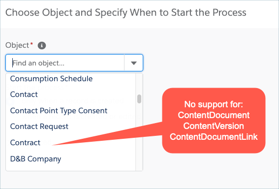
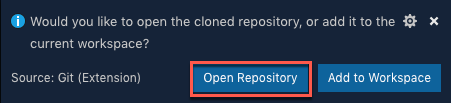
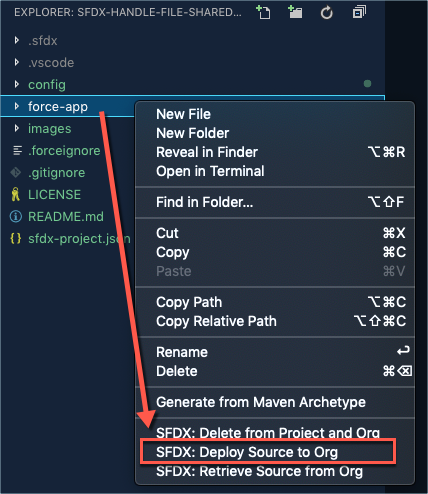
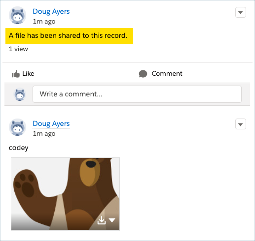

# Handle File Shared to Record Flow

Declaratively handle when files are shared to records.

## Table of Contents
* [Overview](#overview)
* [Deploy Metadata to Your Org](#deploy-metadata-to-your-org)
  * [Deploy Using Visual Studio Code](#deploy-using-visual-studio-code)
  * [Deploy Using Salesforce CLI](#deploy-using-salesforce-cli)
* [Getting Started](#getting-started)
  * [Activate and Test the Flow](#activate-and-test-the-flow)
  * [Customize the Flow](#customize-the-flow)

## Overview

This project is inspired by [Michelle Hansen](https://twitter.com/@mehansen82) who was seeking a way to
call a flow when a file is shared to a record.

As of the Summer '19 release, ContentDocumentLink, ContentDocument, and ContentVersion objects are
not supported in Process Builder to monitor for record changes. Please vote for [Terence Chiu's idea](https://success.salesforce.com/ideaView?id=0873A000000E35YQAS).



Not to be deterred, Michelle and I collaborated to develop an Apex trigger that could
know when a file was being shared to a record and then call an autolaunched flow
where the business logic could be implemented declaratively.

This project is the result of that awesome collaboration 🙂

## Deploy Metadata to Your Org

### Deploy Using Visual Studio Code

> If you are unfamiliar with deploying metadata with Visual Studio Code,
> please complete [Quick Start: Visual Studio Code for Salesforce Development](https://trailhead.salesforce.com/en/content/learn/projects/quickstart-vscode-salesforce?trail_id=sfdx_get_started) before moving forward.

1. Open Visual Studio Code.

2. Clone this repository using the Command Palette.
    - Press `Cmd+Shift+P` on macOS or `Ctrl+Shift+P` on Windows to open the Command Palette.
    - Enter `clone` then choose the **Git: Clone** command.
    - Enter this repository's git url, `https://github.com/douglascayers/sfdx-handle-file-shared-to-record-flow.git`.
    - Select a folder on your computer where to save this repository's content.

3. Click **Open Repository** from the notification that appears.

    

4. Authorize a Salesforce org using the Command Palette.
    - Press `Cmd+Shift+P` on macOS or `Ctrl+Shift+P` on Windows to open the Command Palette.
    - Enter `authorize` then choose **SFDX: Authorize an Org**.
    - Choose the appropriate login option.
    - Enter your desired alias for this org (e.g. `myorg` or `my-sandbox`)
    - A new browser tab will open. Follow the instructions to log in and authorize the Salesforce CLI.
    - Once logged in to your org, return to Visual Studio Code.

5. Deploy this source to your org.
    - In the Explorer side bar, right-click **force-app** folder then choose **SFDX: Deploy Source to Org**.

    

### Deploy Using Salesforce CLI

> If you are unfamiliar with deploying metadata with Salesforce CLI,
> please complete [Quick Start: Salesforce DX](https://trailhead.salesforce.com/en/content/learn/projects/quick-start-salesforce-dx?trail_id=sfdx_get_started) before moving forward.

1. Clone this repository.

    ```
    git clone https://github.com/douglascayers/sfdx-handle-file-shared-to-record-flow.git
    ```

2. Change directory into the project folder.

    ```
    cd sfdx-mass-action-scheduler
    ```

3. Deploy metadata to your org, replacing `YOUR_ORG_ALIAS` with an alias you've already authorized with the Salesforce CLI.

   ```
   sfdx force:source:deploy --targetusername YOUR_ORG_ALIAS --sourcepath force-app
   ```

## Getting Started

### Activate and Test the Flow

1. From Setup, activate the **Handle File Shared to Record Flow** flow you [deployed](#deploy-metadata-to-your-org) to your org.

2. Navigate to an account record and add a file to it, either through the Files related list or through a Chatter post.

3. Refresh the page and note that the flow posted a Chatter message, "A file has been shared to this record."

    

> Congratulations, it worked! Now it's time to customize the flow to suit your needs.

### Customize the Flow

1. From Setup, open the **Handle File Shared to Record Flow** flow.

2. Delete the **Post to Chatter** action, then add any of your own business logic.

3. Save the flow as a new version then activate the new version.

> Go forth and be awesome!

